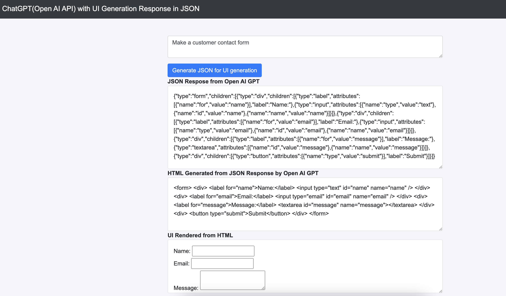

# ChatGPT API Integration Guide

This repository includes useful information for using the Dynamic UI creation with Open AI API And JSON schema. It includes an example of a simple web application using Node.js and Express on the server side, along with basic HTML, CSS, and JavaScript on the client side. For testing purposes, I used a paid plan.


## About

The provided webapp spins up a server that interfaces with OpenAI's ChatGPT API, takes user queries through a web interface, processes those user queries to the API, and then renders the AI response.

- JSON schema is defined for constraining the ChatGPT reponse 
- ChatGPT responds with JSON that is html structure represented as JSON. 
- HTML can be generated from the JSON in UI.

## Getting Started


### Obtaining an OpenAI API Key

1. Visit [OpenAI's API platform](https://platform.openai.com/signup) and sign up or log in.
2. Navigate to the API section and create a new API key for your application.
3. Copy the API key, which you'll use in the app to authenticate API requests.


- `/public`: Static files served by the server.
- `server.js`: Main server file handling API requests.
- `.env`: Contains environment variables like the OpenAI API key.


### Installation

To set up the app, clone the repo and install the dependencies:

```bash
git clone 
cd your-repo-name
npm install
```

### Setup

In the root of your project, create a `.env` file with your OpenAI API key:

```env
OPENAI_API_KEY=your_api_key_here
```

Start the server:

```bash
npm run start or node server.js
```

The server will run on `http://localhost:3000`.


### Prerequisites

- Node.js (LTS version recommended)
- npm (comes with Node.js)
- Basic knowledge of JavaScript and Node.js

### Here is the App Running 

